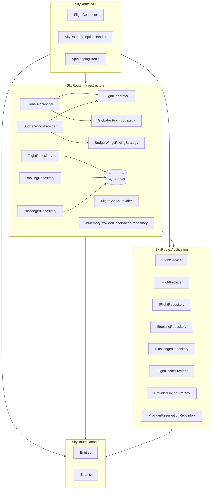
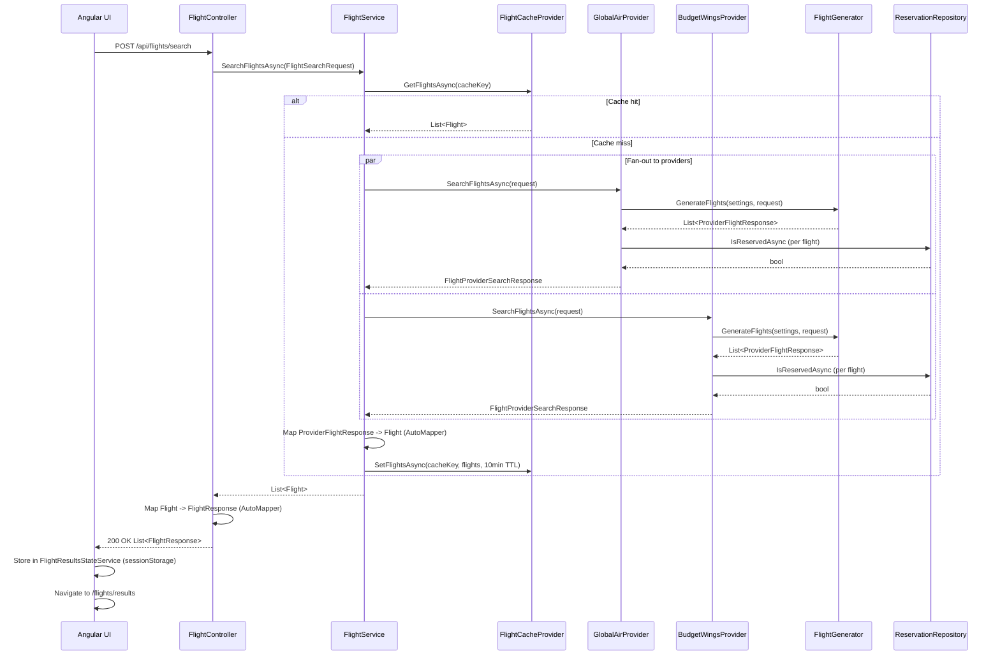
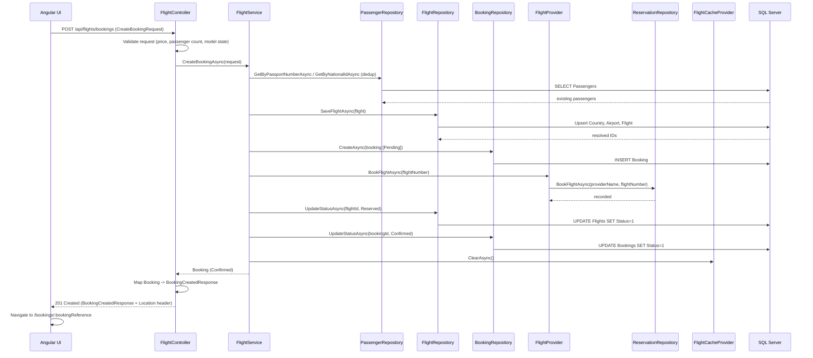
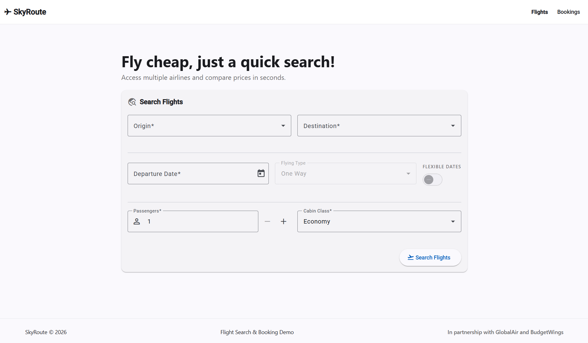
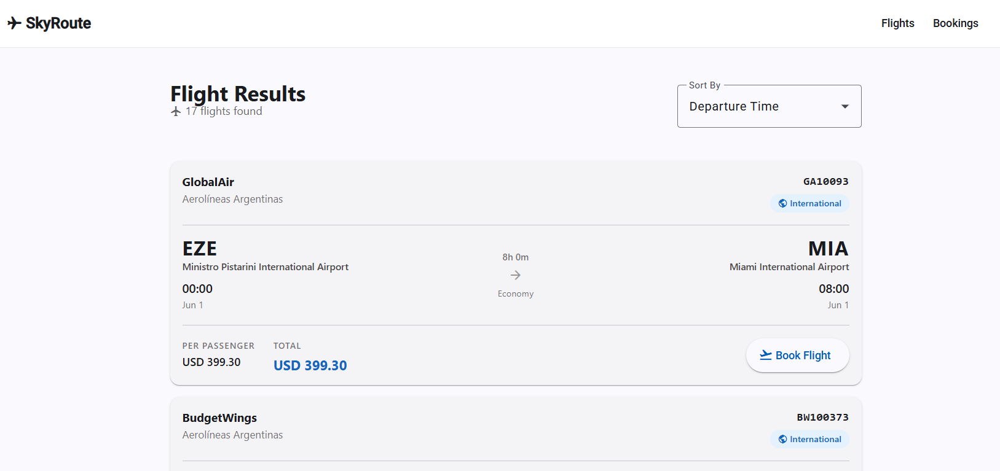
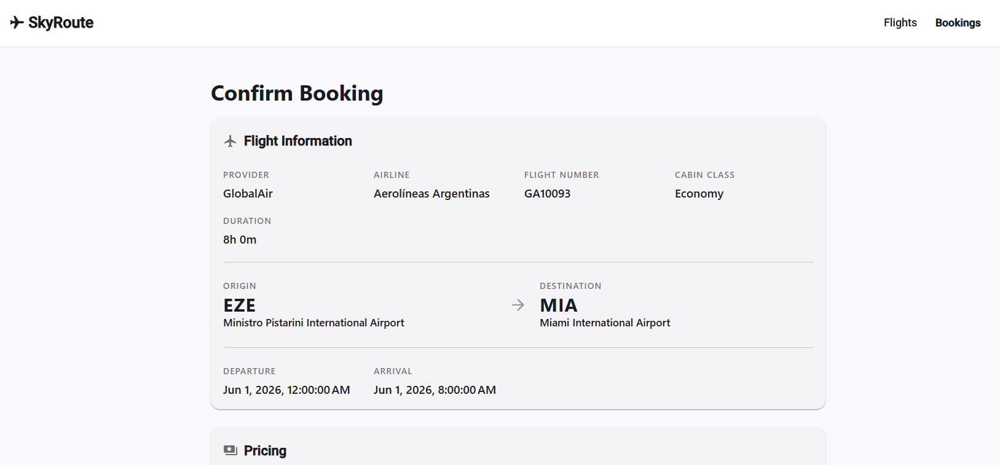

# SkyRoute

## 1. Project Overview

SkyRoute is a Flight Search and Booking platform built as a technical challenge. It demonstrates Clean Architecture principles applied to a .NET 9 backend with an Angular 21 frontend.

The backend exposes a RESTful API that aggregates flight results from multiple simulated airline providers, persists bookings in SQL Server, and applies provider-specific pricing rules. The frontend provides a complete search-to-booking flow with session state persistence and server-side rendering support.

The architecture is intentionally structured to maximize maintainability and extensibility: the domain model is isolated from infrastructure concerns, use-case logic is decoupled from framework details, and providers are plugged in through a shared interface so new ones can be added without touching existing code.

---

## 2. Features

**Flight Search**
- Multi-provider fan-out search: results aggregated in parallel from GlobalAir and BudgetWings
- Search parameters: one-way flight type, origin and destination airport (from seeded reference data), departure date, passenger count (1-9), cabin class (Economy / Business / First)
- Deterministic flight generation: same search inputs always produce the same set of flights from each provider
- In-memory result cache with 10-minute TTL; cache is invalidated on booking

**Flight Results**
- Client-side sorting by price (ascending/descending), duration, and departure time
- Flight cards showing airline, provider, route, departure/arrival times, duration, cabin class, per-passenger price, and total price
- BudgetWings discount badge with struck-through original price for applicable fares
- International vs domestic route badge

**Booking**
- Booking creation with passenger details (full name, email, document number)
- Conditional document validation: passport number (alphanumeric, 9 characters) for international flights, national ID (8 digits) for domestic flights
- Passenger deduplication by document number at the service layer
- Booking reference generated as an 8-character alphanumeric string
- Booking lifecycle: Pending -> Confirmed after provider acknowledgement
- Provider reservation tracking (in-memory per process) to prevent double-booking

**Booking Management**
- List all bookings with status chips (Pending / Confirmed / Cancelled)
- Booking detail view: full flight info, passenger list, pricing summary
- Responsive layout: table view on desktop, card list on mobile

**Reference Data**
- Seeded airports (10 airports: 5 Argentine, 5 US) and countries (Argentina, US)
- Reference data loaded at frontend startup and cached in sessionStorage
- Searchable airport dropdowns with live filtering by code, city, or airport name

**API**
- RESTful JSON API documented with Swagger/OpenAPI (available in Development)
- RFC 7807 ProblemDetails error responses
- CORS open policy for frontend development

---

## 3. Architecture

SkyRoute follows Clean Architecture with four layers. Dependencies always point inward: outer layers depend on inner layers, never the reverse.

```
Domain (innermost, no dependencies)
  ^
  |
Application (depends on Domain only)
  ^
  |
Infrastructure (depends on Application + Domain)
  ^
  |
API / UI (depends on all inner layers)
```

**Domain** (`SkyRoute.Domain`) defines the core data model: entities (`Flight`, `Booking`, `Passenger`, `Airport`, `Country`) and enums (`CabinClass`, `BookingStatus`, `FlightStatus`, `FlightType`, `DocumentType`). It has no NuGet dependencies and no framework references.

**Application** (`SkyRoute.Application`) defines use-case logic through `FlightService`, all repository and provider interfaces (`IFlightRepository`, `IBookingRepository`, `IPassengerRepository`, `IFlightProvider`, `IFlightCacheProvider`, `IProviderPricingStrategy`, `IProviderReservationRepository`), DTOs, and AutoMapper profiles. It depends only on Domain.

**Infrastructure** (`SkyRoute.Infraestructure`) provides concrete implementations: EF Core repositories backed by SQL Server, two flight provider implementations (`GlobalAirProvider`, `BudgetWingsProvider`), an in-memory cache (`FlightCacheProvider`), an in-process reservation store (`InMemoryProviderReservationRepository`), and provider-specific pricing strategies. It depends on Application.

**API** (`SkyRoute.API`) hosts the ASP.NET Core application: the `FlightController`, exception handling middleware, AutoMapper profiles for API models, and all DI wiring in `Program.cs`. It depends on all three inner layers.



---

## 4. Search Workflow

When a user submits a flight search, the following sequence executes:

1. The Angular frontend collects search parameters and calls `POST /api/flights/search`.
2. `FlightController.SearchFlights` resolves airport objects from reference data (already loaded in memory), maps the API request to a `FlightSearchRequest` DTO, and delegates to `IFlightService.SearchFlightsAsync`.
3. `FlightService` builds a cache key from the search parameters and checks `IFlightCacheProvider`. If a cached result exists (TTL 10 minutes), it is returned immediately.
4. On cache miss, `FlightService` fans out to all registered `IFlightProvider` instances (`GlobalAirProvider` and `BudgetWingsProvider`) in parallel via `Task.WhenAll`.
5. Each provider calls `FlightGenerator.GenerateFlights()` with a seeded `Random` (seed derived from the full search input) to produce a deterministic set of flights. Flights already reserved in `IProviderReservationRepository` are filtered out.
6. Each provider's pricing strategy applies a markup or discount to the generated base fare (`GlobalAirPricingStrategy`: +15%; `BudgetWingsPricingStrategy`: -10%, minimum $29.99).
7. Provider responses (`ProviderFlightResponse` list) are mapped to `Flight` domain entities via AutoMapper (`FlightProfile`).
8. Combined results are stored in the cache and returned to the controller.
9. The controller maps `Flight` entities to `FlightResponse` DTOs via `ApiMappingProfile` and returns a `200 OK` with the list.
10. The frontend stores results in `FlightResultsStateService` (persisted to sessionStorage) and navigates to `/flights/results`.



---

## 5. Booking Workflow

After selecting a flight, the user fills in passenger details and confirms. The following sequence executes:

1. The frontend navigates to `/bookings/create`. `CreateBookingPageComponent` reads the selected flight from `SelectedFlightStateService` and passenger count from `SearchCriteriaStateService`.
2. The user fills in one `PassengerFormComponent` per passenger. Validation is conditional: passport number is required for international flights; national ID is required for domestic.
3. On confirm, the frontend calls `POST /api/flights/bookings` with a `CreateBookingRequest` containing the `FlightResponse`, price, and passenger list.
4. `FlightController.CreateBooking` validates the request (including that `Passengers.Count` equals `Flight.PassengerCount` and `Price > 0`), maps models to domain objects, and calls `IFlightService.CreateBookingAsync`.
5. `FlightService.CreateBookingAsync` deduplicates passengers by looking up existing records by passport or national ID in `IPassengerRepository`. New passengers are created; existing ones are reused.
6. A `Booking` entity is created in `Pending` status with a generated 8-character alphanumeric `BookingReference`.
7. The flight is persisted (upserted) via `IFlightRepository.SaveFlightAsync`, which upserts Country and Airport records before saving the Flight.
8. `IFlightProvider.BookFlightAsync` is called on the matching provider (resolved by provider name), which records the reservation in `IProviderReservationRepository`.
9. The flight status is updated to `Reserved` in the database.
10. The booking status is updated to `Confirmed`.
11. The result cache is cleared via `IFlightCacheProvider.ClearAsync` to ensure the reserved flight is excluded from future search results.
12. The controller returns `201 Created` with a `BookingCreatedResponse` and a `Location` header pointing to `GET /api/flights/bookings/{bookingReference}`.
13. The frontend navigates to `/bookings/{bookingReference}` where `BookingDetailPageComponent` loads and displays the full booking detail.



---

## 6. Persistence

**Database:** SQL Server LocalDB (`SkyRouteDb`), configured via connection string in `appsettings.json`. EF Core 9 with Fluent API configuration.

**ORM:** Entity Framework Core with the Code-First approach. Migrations are in `SkyRoute.Infraestructure/Migrations/`.

**Persisted Entities and Schema:**

| Entity | Primary Key | Table | Notable Constraints |
|--------|-------------|-------|---------------------|
| Country | int (identity) | Countries | Code varchar(10) unique, Name varchar(100) |
| Airport | int (identity) | Airports | Code varchar(10) unique, FK -> Countries (Restrict) |
| Flight | Guid | Flights | FlightNumber indexed, Provider indexed, Departure indexed, Duration stored as bigint (ticks), Status default 0 |
| Booking | Guid | Bookings | BookingReference varchar(20) unique, FK -> Flights (Restrict), Status default 0 |
| Passenger | Guid | Passengers | NationalId indexed, PassportNumber indexed, Email indexed |
| BookingPassengers | (join table) | BookingPassengers | Many-to-many Booking <-> Passenger |

**Seeded Data (InitialCreate migration):**
- 2 countries: AR (Argentina), US (United States)
- 10 airports: AEP, EZE, COR, MDZ, SFN (Argentina); ATL, LAX, ORD, DFW, MIA (United States)

**Repository Pattern:** All data access is behind interfaces defined in `SkyRoute.Application.Interfaces`. The generic base `IGenericRepository<TEntity, TKey>` provides `GetByIdAsync`, `GetAllAsync`, `CreateAsync`, `UpdateAsync`, and `DeleteAsync`. Specialized repositories (`IFlightRepository`, `IBookingRepository`, `IPassengerRepository`) extend it with domain-specific queries.

**Notable persistence behaviors:**
- `FlightRepository.SaveFlightAsync` performs an upsert: it resolves Country and Airport records (insert if missing, return existing ID otherwise) before saving the flight. If a flight with the same `FlightNumber` already exists, it syncs the existing `Id` back to the object to maintain FK integrity on re-booking.
- `BookingRepository.CreateAsync` attaches pre-existing passenger entities to the context before adding the booking, preventing duplicate passenger inserts when passengers are reused.
- Bulk status updates use `ExecuteUpdateAsync` (no change tracking overhead).
- All read queries use `AsNoTracking`.

**Migrations:**

| Migration | Description |
|-----------|-------------|
| `20260530144254_InitialCreate` | Creates all tables, seeds countries and airports |
| `20260530164338_AddStatusLifecycle` | Adds `Status` column to Flights, adds indexes on `Status` for both Flights and Bookings, migrates pre-existing bookings to Confirmed |

---

## 7. Flight Generation Strategy

Flights are not fetched from a real airline API. Each provider generates a deterministic set of mock flights via `FlightGenerator.GenerateFlights()` in `SkyRoute.Infraestructure`.

**Determinism via seeded Random:** The seed is constructed by combining: provider name, passenger count, cabin class, flight type, flex-dates flag, and for each search leg: origin code, destination code, departure date. The same search input always produces the same flights from the same provider session.

**Flight count:** A random integer between `settings.MinFlights` and `settings.MaxFlights` (inclusive). GlobalAir: 3-10 flights; BudgetWings: 2-8 flights.

**Departure times:** Chosen from fixed slots: `00:00, 01:30, 02:30, 06:00, 08:30, 11:00, 14:00, 17:30, 20:00, 22:30`.

**Duration logic:**
- AR -> AR domestic: randomly selected from `[60, 80, 90, 110]` minutes
- US -> US domestic: one of those values multiplied by 2 (120-220 minutes)
- International routes: randomly selected from `[480, 600, 720]` minutes (8-12 hours)

**Base fare calculation:**
- Price per hour: $40 for international, $25 for domestic
- `baseFare = (durationMinutes / 60) * pricePerHour`
- Cabin multiplier: Economy = 1.0x, Business = 2.0x, First = 3.5x
- Random variation band: 90%-110% of the multiplied fare

**Provider pricing applied on top of base fare:**
- `GlobalAirPricingStrategy`: 15% markup (`baseFare * 1.15`)
- `BudgetWingsPricingStrategy`: 10% discount (`baseFare * 0.90`), minimum price clamped at $29.99

**Airline assignment:**
- AR <-> US international routes: always "Aerolineas Argentinas"
- AR -> AR domestic: randomly chosen from "Aerolineas Argentinas", "Flybondi", "JetSMART Argentina"
- US -> US domestic: randomly chosen from "American Airlines", "Delta Air Lines", "United Airlines"
- Other routes: randomly chosen from the Argentine airline list

Note: airline selection uses an unseeded `new Random()` rather than the seeded instance, so airline names are not deterministic across runs.

**Flight code format:** `{FlightPrefix}{1000 + index}{Math.Abs(seed) % 100}` — for example, `GA100042` (GlobalAir) or `BW200117` (BudgetWings).

**Cabin class resolution:** If the requested cabin class is in `settings.SupportedCabins`, it is honored. Otherwise the first supported cabin is used. BudgetWings only supports Economy, so Business or First requests will always return Economy results from that provider.

**Availability filtering:** Before returning results, each provider calls `IProviderReservationRepository.IsReservedAsync` for each generated flight number and removes any that have been booked in the current process lifetime.

---

## 8. Provider Configuration

Providers are configured via the `FlightProviders` section in `appsettings.json` using named options. Each entry maps to a `FlightProviderSettings` instance:

```json
"FlightProviders": {
  "GlobalAir": {
    "ProviderName": "GlobalAir",
    "FlightPrefix": "GA",
    "MinFlights": 3,
    "MaxFlights": 10,
    "MinDurationMinutes": 60,
    "MaxDurationMinutes": 300,
    "MinPrice": 100,
    "MaxPrice": 500,
    "SupportedCabins": [1, 2, 3]
  },
  "BudgetWings": {
    "ProviderName": "BudgetWings",
    "FlightPrefix": "BW",
    "MinFlights": 2,
    "MaxFlights": 8,
    "MinDurationMinutes": 45,
    "MaxDurationMinutes": 240,
    "MinPrice": 0,
    "MaxPrice": 100,
    "SupportedCabins": [1]
  }
}
```

Cabin values map to the `CabinClass` enum: Economy = 1, Business = 2, First = 3.

**Provider abstraction:** All provider logic is accessed through `IFlightProvider` (`Provider` property, `SearchFlightsAsync`, `BookFlightAsync`). `FlightService` receives `IEnumerable<IFlightProvider>` and iterates all registered providers. Adding a third provider requires:
1. Creating a class that extends `BaseFlightProvider`
2. Adding a `FlightProviderSettings` entry in `appsettings.json`
3. Registering the class as `IFlightProvider` in `Program.cs`

**Pricing abstraction:** Each provider instantiates its own `IProviderPricingStrategy` (`GlobalAirPricingStrategy` or `BudgetWingsPricingStrategy`). The strategy is injected into `BaseFlightProvider` and applied inside `FlightGenerator`. A new provider can supply any pricing logic by implementing `IProviderPricingStrategy`.

---

## 9. Design Decisions

**Clean Architecture layer separation:** Business logic in `FlightService` references only interfaces and domain entities. It has no knowledge of SQL Server, EF Core, or HTTP. This allows the infrastructure to be swapped (e.g., replacing SQL Server with PostgreSQL) without touching the application layer.

**Repository Pattern with generic base:** `IGenericRepository<TEntity, TKey>` centralizes CRUD operations. Specialized repositories add domain queries on top. This reduces boilerplate while keeping each repository's contract explicit.

**Provider Strategy Pattern:** `IFlightProvider` and `IProviderPricingStrategy` decouple flight generation and pricing from the aggregation logic. `FlightService` does not know how many providers exist or how they price flights. The fan-out in `SearchFlightsAsync` via `Task.WhenAll` allows true parallel execution and makes adding a slow real provider non-blocking to the others.

**Named Options for provider configuration:** `IOptionsMonitor<FlightProviderSettings>` with named instances ("GlobalAir", "BudgetWings") allows each provider to read its own configuration section without hardcoding. The same `FlightProviderSettings` class serves both providers.

**AutoMapper for layer boundary mapping:** Three distinct mapping boundaries exist: Infrastructure (`ProviderFlightResponse` -> `Flight`), API inbound (`SearchFlightsRequest` -> `FlightSearchRequest`), and API outbound (`Flight` -> `FlightResponse`, `Booking` -> `BookingResponse` variants). Keeping these in separate profiles (`FlightProfile`, `ApiMappingProfile`) isolates the concerns of each layer transition.

**In-memory cache for search results:** `FlightCacheProvider` wraps `IMemoryCache` with a key registry to support bulk `ClearAsync`. The 10-minute TTL prevents stale flight data from being returned after a booking invalidates availability.

**In-memory reservation store:** `InMemoryProviderReservationRepository` tracks per-provider reservations as a `HashSet<string>` keyed on `"{providerName}:{flightNumber}"`. As a Singleton, it persists for the process lifetime. This is sufficient for a mock provider scenario but would require a distributed store in a multi-instance deployment.

**Passenger deduplication:** Before inserting passengers, `FlightService` looks up existing records by passport number or national ID. This prevents duplicate passenger rows across multiple bookings by the same traveler.

**Flight denormalization on Booking:** `Booking` stores `FlightNumber` as a string in addition to `FlightId`. This preserves a human-readable reference to the flight even if the Flight record were later altered.

**Deterministic flight generation:** Using a seeded `Random` ensures that the same search query always returns the same flights within a session. This makes the search behavior predictable and testable without a real provider.

---

## 10. User Interface

The Angular 21 frontend is located in `skyroute-ui/`. It uses Angular Material 21 for all UI components and Angular signals for reactive state management. Session state (search criteria, flight results, selected flight, reference data) is persisted to `sessionStorage` so browser refreshes do not lose context.

### Flight Search



The home page (`/`) presents a search form built with `FlightSearchFormComponent`. The user selects an origin and destination airport from searchable dropdowns powered by `ngx-mat-select-search`, which filters by IATA code, city, or airport name. A cross-field validator prevents selecting the same airport for both fields. The departure date picker enforces a minimum of today's date. Passenger count is controlled by stepper buttons bounded between 1 and 9. Cabin class (Economy, Business, First) is selected from a dropdown. Flight type and flexible dates controls are visible but disabled in the current implementation; only one-way search is functional.

On submit, the form calls `FlightApiService.searchFlights()`, stores results in `FlightResultsStateService`, and navigates to `/flights/results`.

### Search Results



The results page (`/flights/results`) renders a list of `FlightCardComponent` instances from `FlightResultsStateService`. A sort control offers four options: price ascending, price descending, duration, and departure time, computed client-side via Angular signals. Each card displays the provider name, airline, flight number, an international or domestic badge, the full route (origin and destination airport code, name, city, departure and arrival times), flight duration, cabin class, per-passenger price, and total price. For BudgetWings flights priced above $29.99, an "OFFER" badge shows the discounted price alongside a struck-through original amount. The page handles three states explicitly: loading (spinner), empty (no flights found message), and populated (card list). Selecting a flight stores it in `SelectedFlightStateService` and navigates to `/bookings/create`.

### Booking



The booking confirmation page (`/bookings/create`) is handled by `CreateBookingPageComponent`. It displays a summary of the selected flight (provider, airline, flight number, cabin class, duration, route, departure and arrival times) alongside the dynamic pricing breakdown (per-passenger price times passenger count from the original search). For each passenger, a `PassengerFormComponent` is rendered. Each form collects full name, email address, and a document number. The document field type is conditional: international flights require a passport number (9 alphanumeric characters); domestic flights require a national ID (8 digits). On submit, the form calls `BookingApiService.createBooking()`. On success, the user is navigated to `/bookings/{bookingReference}` where the full booking detail is displayed with a status badge, flight info card, passenger list, and pricing summary.

---

## 11. Running the Project

### Requirements

- .NET 9 SDK
- SQL Server LocalDB (included with Visual Studio 2022)
- Node.js (LTS recommended, compatible with Angular 21)
- Angular CLI 21: `npm install -g @angular/cli`

### Backend

Apply database migrations before the first run:

```bash
cd SkyRoute.API
dotnet ef database update
```

Start the API:

```bash
dotnet run
```

The API listens on `http://localhost:5294` (HTTP) and `https://localhost:7025` (HTTPS) in Development mode.

### Frontend

```bash
cd skyroute-ui
npm install
ng serve
```

The Angular dev server starts at `http://localhost:4200`. The frontend calls the backend at `http://localhost:5294` by default (`FlightApiService` and `BookingApiService` base URL).

### Swagger

The Swagger UI is available in Development only at:

```
http://localhost:5294/swagger
```

or

```
https://localhost:7025/swagger
```

The OpenAPI spec is served at `/swagger/v1/swagger.json`.

---

## 12. Future Improvements

### Booking Management

Planned but not implemented: ability to cancel a booking (update status to `Cancelled`), edit passenger details after booking, and email or reference-based booking lookup without authentication. The `BookingStatus.Cancelled` enum value and the `UpdateStatusAsync` repository method are already in place at the infrastructure level; the controller endpoint and frontend views remain to be built.

### Flight Types

Round-trip and multi-city search are defined in the `FlightType` enum and present as disabled controls in the search form, but are not yet functional. Planned work includes: multi-leg `FlightSearchRequest` handling in `FlightService`, round-trip result grouping, date-range flexible search (the `FlexDates` flag is plumbed through the full request chain but has no generator behavior today), and a `dateRangeValidator` already present in the frontend but not wired to any form.

### Authentication and Authorization

No authentication is implemented. Planned: JWT-based authentication with user accounts, so bookings are scoped to a logged-in user rather than visible to all API consumers. The `app.UseAuthorization()` call is already in the middleware pipeline but has no policies configured.

---

## 13. Technical Notes

**Mock providers, not real integrations:** `GlobalAirProvider` and `BudgetWingsProvider` generate synthetic flights from a seeded random number generator. They do not call any external API. The `IFlightProvider` interface is designed so a real HTTP-backed provider could be substituted without changing the application layer.

**Reservation store is in-process only:** `InMemoryProviderReservationRepository` uses a `HashSet` in a Singleton. Reservations are lost on application restart, and the system would oversell in a multi-instance deployment. A distributed cache or database-backed reservation table would be required for production.

**Flight generation is not fully deterministic:** Airline name selection within `FlightGenerator` uses `new Random()` (unseeded) rather than the seeded instance used for other attributes. Airline names can vary across runs for the same search input.

**LocalDB connection string:** The default connection string targets `(localdb)\MSSQLLocalDB`, which is Windows-only and requires Visual Studio or the SQL Server Express LocalDB redistributable. No Docker Compose or cross-platform database setup is provided.

**No test projects:** The solution contains no unit or integration test projects. The clean layer separation and interface-driven design make the codebase well-suited for testing, but no tests were written as part of this challenge.

**No CI/CD pipeline:** No GitHub Actions workflows or other pipeline configuration files are present.

**Infrastructure project naming:** The infrastructure project is named `SkyRoute.Infraestructure` (Spanish spelling of "infrastructure"), which is consistent throughout the solution.

**`Microsoft.Extensions.Caching.Memory` version mismatch:** The infrastructure project references version `10.0.8` of this package while targeting `net9.0`. This is an out-of-band version ahead of the .NET 9 release band and may require attention when updating the SDK version.

**CORS policy:** The API is configured with an open CORS policy (`AllowAnyOrigin`, `AllowAnyMethod`, `AllowAnyHeader`). This is acceptable for a local development challenge but must be restricted in any deployed environment.

**`FlightType` and `DocumentType` enums in domain:** `FlightType` is defined in the domain but is not a persisted property on any entity; it travels only as a search parameter. `DocumentType` is defined but the `Passenger` entity stores separate `NationalId` and `PassportNumber` nullable strings instead of a typed document object. Both enums would need entity-level changes to be fully leveraged.
